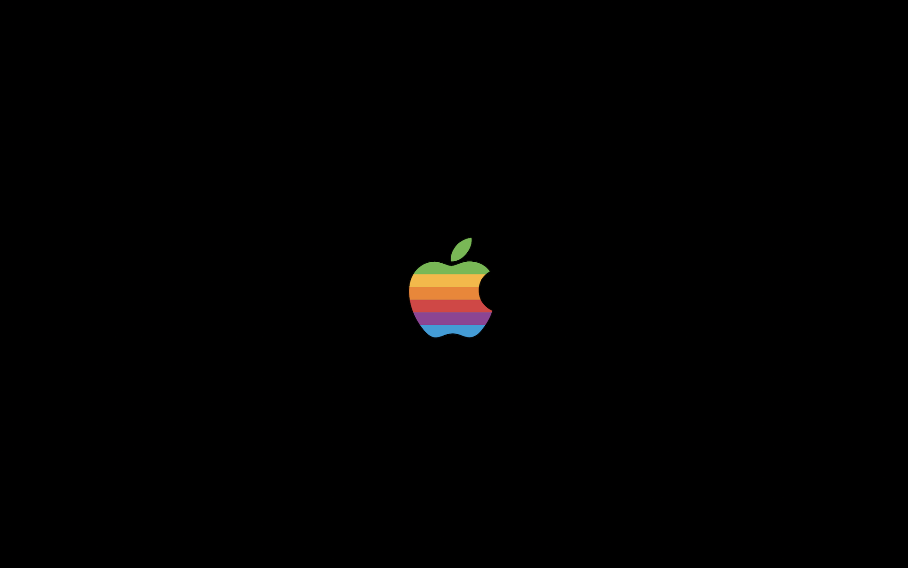

# Fruit

Screensaver of the vintage Apple logo made purely with `NSBezierPath` and masks in Objective-C. Now animated!

## Install

### Manual

To get the latest binary please click [here](https://github.com/ppamorim/fruit/releases/download/1.0/Fruit.saver.zip).

### Why it's not available in `brew cask`?

Since `brew cask` limits your projects that have at least 50 stars, I am unable to make it available in their repository until I get this minimum number of stars. Please help me and give a star in the project. :)

## License

Fruit is available under the MIT license. See the [LICENSE](https://github.com/ppamorim/fruit/blob/master/LICENSE) file for more information. Logo & original animations are Apple's property.