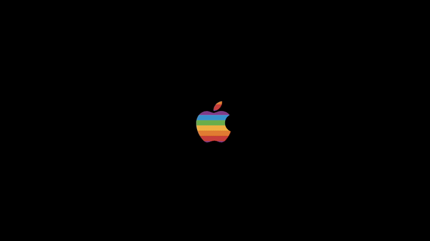

# Fruit

Screensaver of the vintage Apple logo made purely with `NSBezierPath` and masks in Objective-C. Now animated!

Available on OSX Mavericks and up. (Not tested but expected to work on MacOS Catalina)

### Install

1. [Click here to Download](https://github.com/ppamorim/fruit/releases/download/1.1/Fruit.saver.zip)
2. Open **Fruit.saver** (double click).
3. `"Fruit.saver" can't be opened because it is from an unidentified developer` will appear, press `OK`.
4. Open `Preferences`.
5. Select `Security & Privacy`.
6. Select `General`.
7. On the bottom side, select `Open Anyway`.

If this doesn't work, please do the manual described below.

### Install from the source code

1. Clone the project.
2. Open the `Fruit.xcodeproj` and `Archive` it.
3. Open the products folder and right click on **Fruit.saver**, Click on `Show in Finder` and double click the file.
4. You should have installed it by now, go to your screensaver settings and confirm if the screensaver is selected.

If the screenshot displays a black screen, you need to do some actions to get it back:

1. Delete your old output files before running a new build.
2. Build your project.
3. Go to **Activity Monitor** and force quit any `legacyScreenSaver` processes (especially on Sonoma – we’ll discuss this more [later](https://zsmb.co/building-a-macos-screen-saver-in-kotlin/#macos-sonoma)).
4. Go to **System Settings**, choose any screen saver other than your custom one.
5. Delete your custom screen saver from **System Settings**.
6. Quit **System Settings**.
7. Install your new screen saver and perform the dialog dance.

### Why it's not available in `brew cask`?

Since `brew cask` limits your projects that have at least 50 stars, I am unable to make it available in their repository until I get this minimum number of stars. Please help me and give a star in the project. :)

## License

Fruit is available under the MIT license. See the [LICENSE](https://github.com/ppamorim/fruit/blob/master/LICENSE) file for more information. Logo & original animations are Apple's property.
